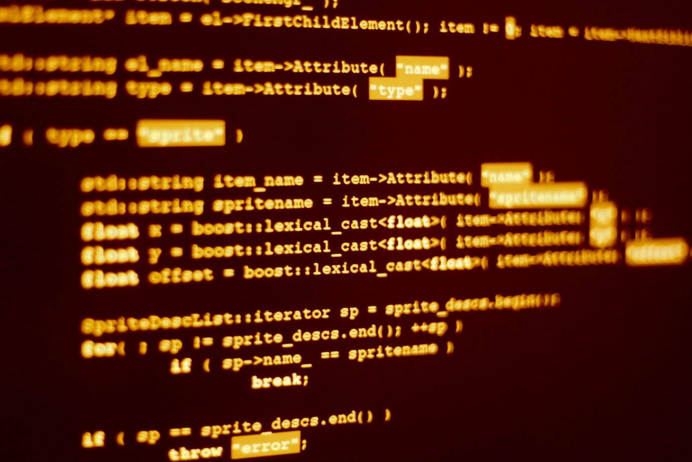

<h1 align="center"> Dev Michael</h1>

programa exclusivo e gratuito, promovido pela Rocketseat para ensino de tecnologias WEB.

  <a href="#-tecnologias">Tecnologias</a>&nbsp;&nbsp;&nbsp;|&nbsp;&nbsp;&nbsp;
  <a href="#-projeto">Projeto</a>&nbsp;&nbsp;&nbsp;|&nbsp;&nbsp;&nbsp;
  <a href="#-layout">Layout</a>&nbsp;&nbsp;&nbsp;|&nbsp;&nbsp;&nbsp;
  <a href="#memo-licença">Licença</a>

  

 

  

## 🚀 Tecnologias

Esse projeto está sendo desenvolvido com as seguintes tecnologias (até o momento):

- HTML e CSS
- JavaScript
- Git e Github
- Figma

## 💻 Projeto

Projeto para praticar e aprender novos comandos via curso "Explorer" da Rocketseat, QUando terminado terá uma descrição mais elaborada.
## 🔖 Layout

Ainda sendo desenvolvido (não terminado)

## :memo: Licença

Privada

---

Feito com ♥ junto à Rocketseat via curso online :wave: [Participe da nossa comunidade!](https://discord.gg/rocketseat)
